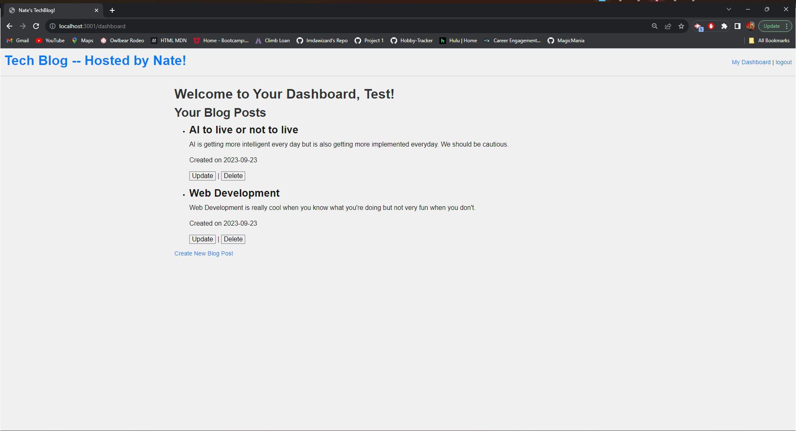
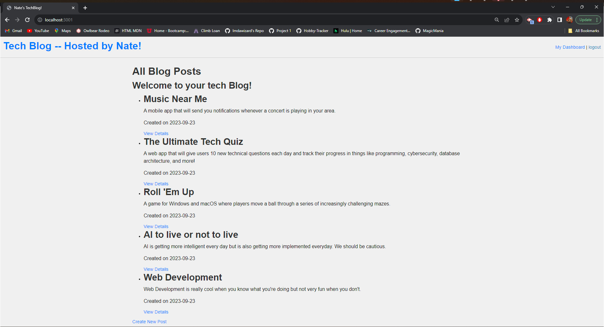
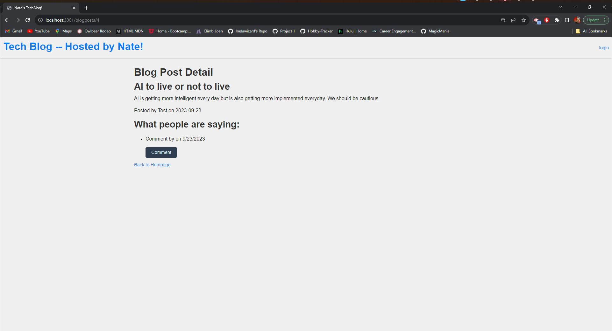

# Tech Blog
The project for week 14---A Model-View-Controller Tech blog

## Table of Contents
 - [Installation](#installation)
 - [usage](#usage)
 - [License](#license)
 - [Features](#featues)
 - [Contribution Guidelines](#contributing)
 - [Questons/Contact](#questions)

# Description
Tech Blog is a modern content managment system(CMS)-style web application that empowers developers and tech enthuasiasts to publish their blog posts, engage in discussions, and build an online tech community. Built on a robust architecture following the Model-View-Controller(MVC) paradigm, the application is feature-rich and user-friendly.

## Installation
You will need:
1. Node downloaded onto your machine.
2. Express downloaded and initiated.
3. Inquirer package downloaded and initiated.
4. All other packages can be initiated by running npm install with the help of the package.json file

## Usage
This is a fully-functioning website. On the homepage you will be presented with previous blogposts. There will be an option to login,if you click on that you will have the option to sign-up or login. Once logged in you are able to create new posts and or comment on other people's posts!

## License
This project does not currently have a license.

## Features
There are many options to interact with the database, they include:
- Login sessions powered by express-sessions
- Sessions are set, meaning after an alotted time user will be automatically logged out
- Passwords are hashed using bycrypt
- Users are able to create, update, and delete blogposts
- Users are able to create comments, comment on other posts, and update and delete their own comments
- Users can create their own profiles and their posts and comments are stored in back-end database

## Contribution Guidelines
This is a private project for instructional purposes. Future contributions are unlikely but possible.

### Questions
For any questions, please contact me:

GitHub: [Nate's Repo](https://github.com/imdawizard)

Email: nate.is.cool.yeah@gmail.com

## Link to deployed application:
https://imdawizard.github.io/tech_blog/

## Link to deployed Heroku app:
- https://tech-blog-imdawizard-9c1ea840933a.herokuapp.com/
- https://git.heroku.com/tech-blog-imdawizard.git

## Screenshots!

